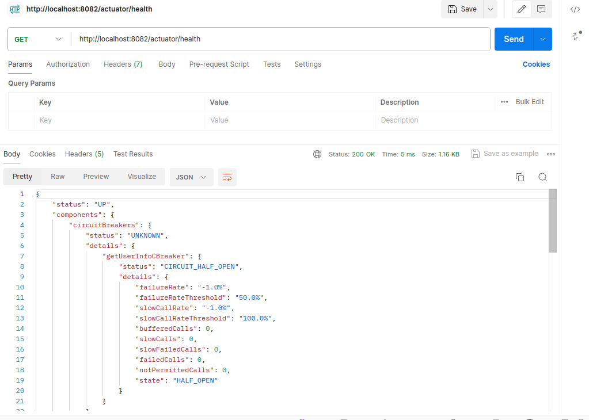
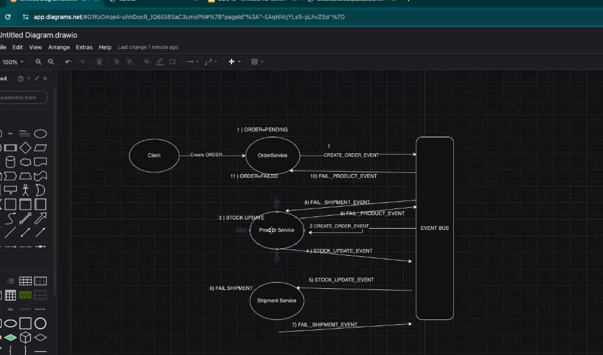
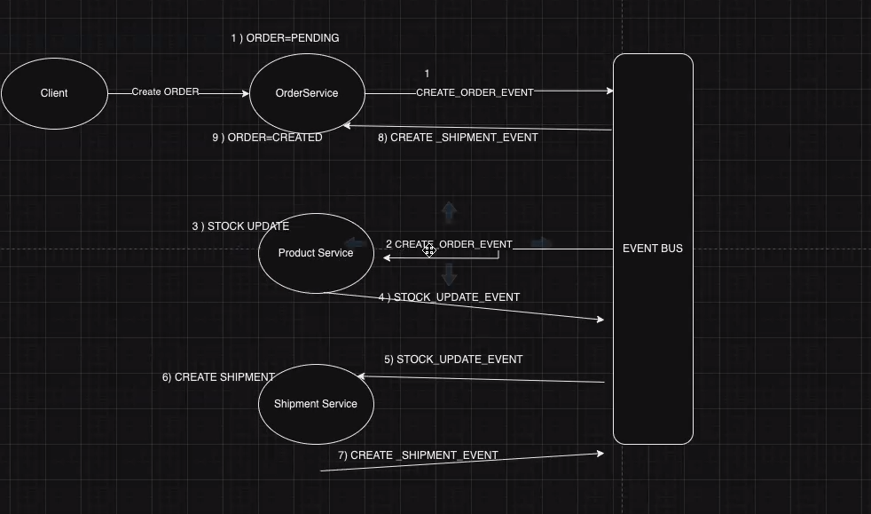

# E-Ticaret Projesi

Bu proje, Java 17 ve Spring Boot kullanarak mikroservis mimarisi ile geliştirilmiş bir e-ticaret platformudur. Projede, sipariş yönetimi, ürün yönetimi, kargo takibi, e-posta bildirimleri ve API geçidi gibi çeşitli hizmetler bulunmaktadır. Ayrıca, Eureka ile servis keşfi de sağlanmaktadır.

## Proje Yapısı

Proje aşağıdaki mikroservislerden oluşmaktadır:

1. **Order Service**: Sipariş yönetimi
2. **Product Service**: Ürün yönetimi
3. **Shipment Service**: Kargo takibi
4. **Mail Service**: E-posta bildirimleri
5. **API Gateway**: Merkezi API geçidi
6. **Eureka Server**: Servis keşfi ve kayıt

## Başlarken

### Gereksinimler

- Java 17
- Spring Boot
- Maven
- Docker (opsiyonel, konteynerleştirme için)
- Redis

## Kullanım

- **Order Service**
- **Product Service**
- **Shipment Service**
- **User Service**
- **Mail Service**
- **Eureka Server**
- **API Gateway**

Circuit Breaker success

Circuit Breaker(Circuit half open status)

Saga pattern fail case diagram

Saga pattern diagram

